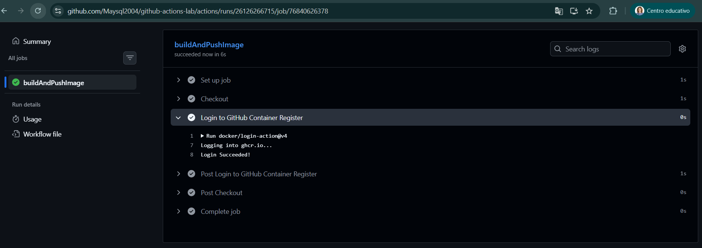
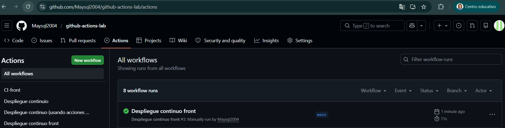
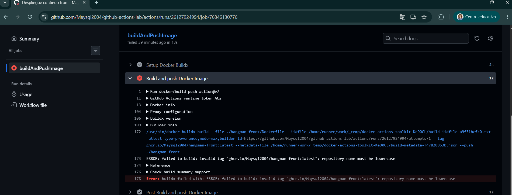
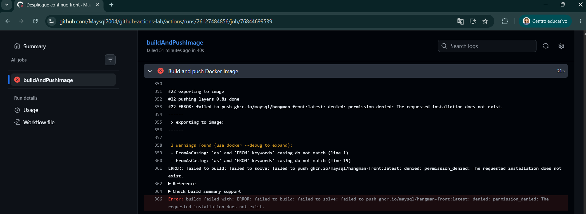
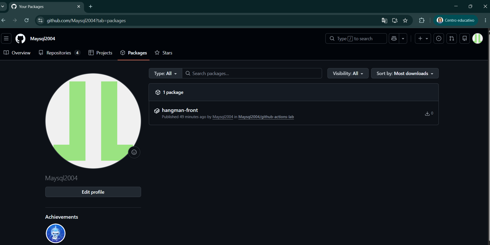

# github-actions-lab

## 1. Workflow CI para el proyecto de frontend

El workflow de este apartado está en el fichero ci-front.yaml. En él se puede ver que los eventos que disparan el workflow son el *push* y el *pull_request* definidos en *on*.

Los pasos de los que está compuesto son los indicados en los jobs, build y test. Las acciones de *GitHub Actions* usadas son *actions/checkout* y *actions/setup-node*.

Vamos a crear un workflow en Github para el proyecto *hangman-front* donde usamos la integración continua para automatizar el *build* y los *test* unitarios, siempre que haya cambios (push o pull requests) en la rama main, y en concreto en la carpeta hangman-front.

Para ello, creamos el archivo y carpetas en la carpeta raiz del proyecto: .github/workflows/ci-frontend.yaml

**ci-frontend.yaml**
```
name: CI-front

on:
  pull_request:
    branches: [ main ]
    paths: ['hangman-front/**']
  push:
    branches: [ main ]
    paths: [ 'hangman-front/**' ]

jobs:
  build:
    runs-on: ubuntu-latest

    steps:
      - name: Checkout
        uses: actions/checkout@v6
      - name: Setup Node.js version
        uses: actions/setup-node@v6
        with:
          node-version: 18
      - name: Build
        working-directory: ./hangman-front
        run: |
          npm ci
          npm run build --if-present

  test:
    runs-on: ubuntu-22.04
    needs: build

    steps:
      - name: Checkout
        uses: actions/checkout@v6
      - name: Setup Node.js version
        uses: actions/setup-node@v6
        with:
          node-version: 18
      - name: Unit tests
        working-directory: ./hangman-front
        run: |
          npm ci
          npm run test
```
La estructura del archivo YAML organiza cuando debe ejecutarse el workflow en *on:* y qué acciones va a seguir en *jobs:*.

El proceso utiliza actions de GitHub para mover el código a un entorno virtual, donde primero se ejecuta el build y, si este es correcto, se procede con el test.

Esto lo probamos haciendo un commit y push a GitHub. Hay que recordar que, debido a la directiva paths: configurada en el YAML, el workflow solo se activará si modificamos algún archivo dentro de la carpeta hangman-front.

1ª ejecución del workflow: fallo en el job test. Mirando los logs dentro del workflow vemos el error:


*Solución*

Modificamos la línea 16 del archivo /hangman.front/src/components/start-game.spec-tsx, aumentando la longitud experada de 1 a 2.


Después de la modimficación en el archivo, de nuevo hago el push y esta vez el workflow funciona con éxito.


## 2. Workflow CD para el proyecto de frontend

El workflow de este apartado está en el fichero cd-front.yaml. Tal y como podemos ver definido en on, no hay ningún evento que dispare el workflow, sino que se dispara manualmente.

Ahora toca realizar un workflow de Continuous delivery que va a crear una imagen de Docker a partir del Dockerfile de la carpeta ./hangman-front, y además la tendremos publicada en el Github Container Registry (ghcr.io).

1º Parte, crear el archivo .github/workflows/cd-frontend.yaml, con el contenido:

```
name: Despliegue continuo front

on:
  workflow_dispatch:

jobs:
  buildAndPushImage:
    runs-on: ubuntu-latest

    steps:
      - name: Checkout
        uses: actions/checkout@v6
      - name: Login to GitHub Container Register
        uses: docker/login-action@v4
        with:
          registry: ghcr.io
          username: ${{ github.actor }}
          password: ${{ secrets.GITHUB_TOKEN }}
```
Como resultado obtengo





Con la palabra reservada workflow_dispatch es la que le dice al workflow que se ejecute de forma manual, es decir, en la pestaña de Actions del proyecto de Github debemos darle al botón para lanzar el workflow.


Algunos de los pasos (steps) del job son iguales que en el workflow de CI, como el checkout para llevar el código de la aplicación a la máquina virtual de Github donde se ejecutarán las acciones del workflow. Usamos otra action de Github para autenticarnos a ghcr.io, y otra para crear la imagen de docker y subirla a ghcr.io.

2ª Parte, añadimos al archivo .github/workflows/cd-frontend.yaml el siguiente contenido:

```
- name: Setup Docker Buildx
        uses: docker/setup-buildx-action@v4
      - name: Build and push Docker Image
        uses: docker/build-push-action@v7
        with:
          context: ./hangman-front
          push: true
          tags: ghcr.io/maysql2004/hangman-front:latest
          file: ./hangman-front/Dockerfile
```
Analizando el workflow, este job se ejecuta en Ubuntu para contruir una imagen Docker y subirla a GitHub Container Registry (GHCR).

Pasos del proceso
- Clonar: Descarga el código del repositorio.
- Autenticar: Inicia sesión en ghcr.io con un token automático de GitHub.
- Configurar: Activa Docker Buildx para optimizar la compilación y la caché.
- Publicar: Construye la imagen Docker y la sube al registro.

Acciones utilizadas
- actions/checkout: Clona el repositorio.- docker/login-action: Gestiona el login en ghcr.
- docker/setup-buildx-action: Configura las funciones avanzadas de Buildx.
- docker/build-push-action: Compila y publica la imagen.

**Problemas con los que me he encontrado**

1º Intentaba utilizar las credenciales para el login del container registry de GitHub con tag Maysql2004/hangman-front:latest y resulta que no puedo usar la maúscula de mi nombre de usuario.

 

2º El siguiente error se produjo por una cuestión de permisos, la instalación no tiene permitida la creación de paquetes.



La solución está en ir a los Settings del repositorio de GitHub e indicándole que se le permite a los workflows su lectura y escritura:
- Settings-->Actions-->General

**Modificación de los Settings del repositorio**


Con ello, ya podremos ver la imagen publicada en los packages de mi repositorio


