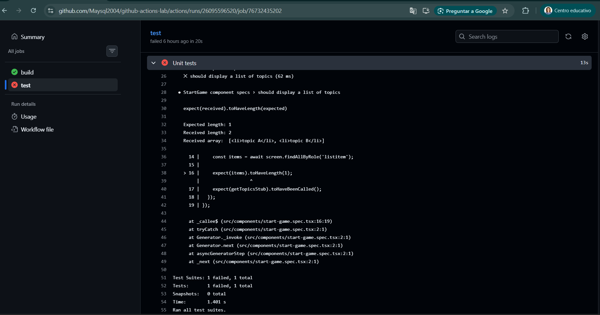
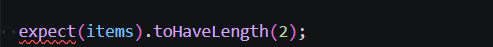
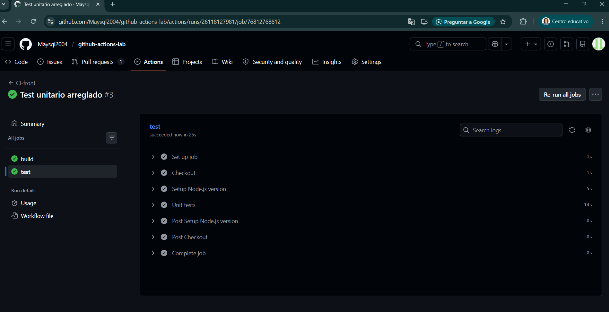

# github-actions-lab

## 1. Workflow CI para el proyecto de frontend

El workflow de este apartado está en el fichero ci-front.yaml. En él se puede ver que los eventos que disparan el workflow son el *push* y el *pull_request* definidos en *on*.

Los pasos de los que está compuesto son los indicados en los jobs, build y test. Las acciones de *GitHub Actions* usadas son *actions/checkout* y *actions/setup-node*.

Vamos a crear un workflow en Github para el proyecto *hangman-front* donde usamos la integración continua para automatizar el *build* y los *test* unitarios, siempre que haya cambios (push o pull requests) en la rama main, y en concreto en la carpeta hangman-front.

Para ello, creamos el archivo y carpetas en la carpeta raiz del proyecto: .github/workflows/ci-frontend.yaml

**ci-frontend.yaml**
```
name: CI-front

on:
  pull_request:
    branches: [ main ]
    paths: ['hangman-front/**']
  push:
    branches: [ main ]
    paths: [ 'hangman-front/**' ]

jobs:
  build:
    runs-on: ubuntu-latest

    steps:
      - name: Checkout
        uses: actions/checkout@v6
      - name: Setup Node.js version
        uses: actions/setup-node@v6
        with:
          node-version: 18
      - name: Build
        working-directory: ./hangman-front
        run: |
          npm ci
          npm run build --if-present

  test:
    runs-on: ubuntu-22.04
    needs: build

    steps:
      - name: Checkout
        uses: actions/checkout@v6
      - name: Setup Node.js version
        uses: actions/setup-node@v6
        with:
          node-version: 18
      - name: Unit tests
        working-directory: ./hangman-front
        run: |
          npm ci
          npm run test
```
La estructura del archivo YAML organiza cuando debe ejecutarse el workflow en *on:* y qué acciones va a seguir en *jobs:*.

El proceso utiliza actions de GitHub para mover el código a un entorno virtual, donde primero se ejecuta el build y, si este es correcto, se procede con el test.

Esto lo probamos haciendo un commit y push a GitHub. Hay que recordar que, debido a la directiva paths: configurada en el YAML, el workflow solo se activará si modificamos algún archivo dentro de la carpeta hangman-front.

1ª ejecución del workflow: fallo en el job test. Mirando los logs dentro del workflow vemos el error:



*Solución*

Modificamos la línea 16 del archivo /hangman.front/src/components/start-game.spec-tsx, aumentando la longitud experada de 1 a 2.



Después de la modimficación en el archivo, de nuevo hago el push y esta vez el workflow funciona con éxito.



## 2. Workflow CD para el proyecto de frontend


